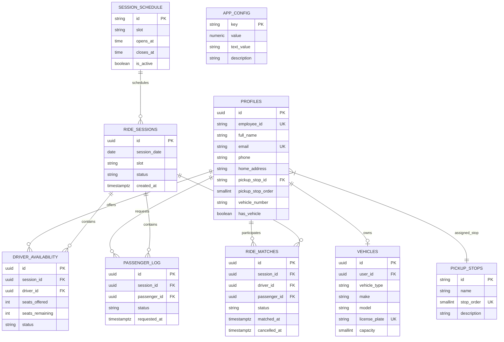
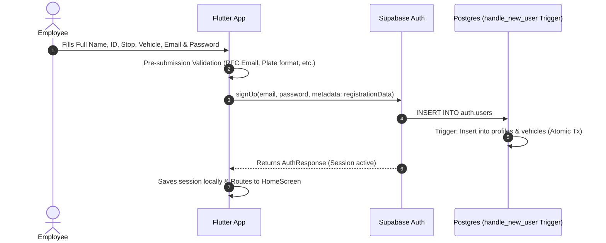
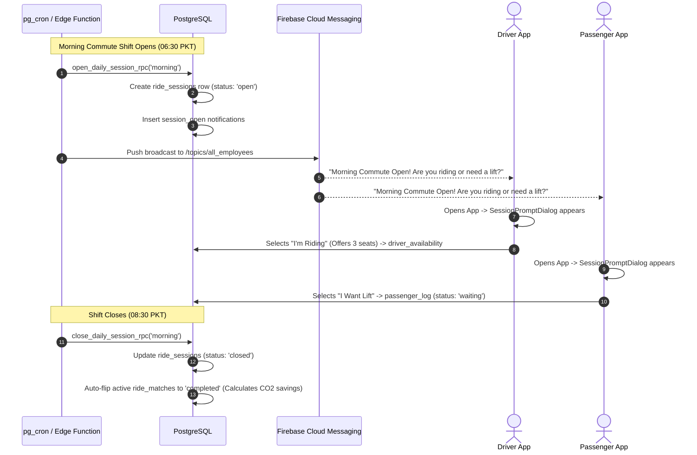
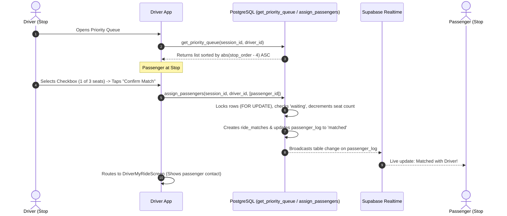
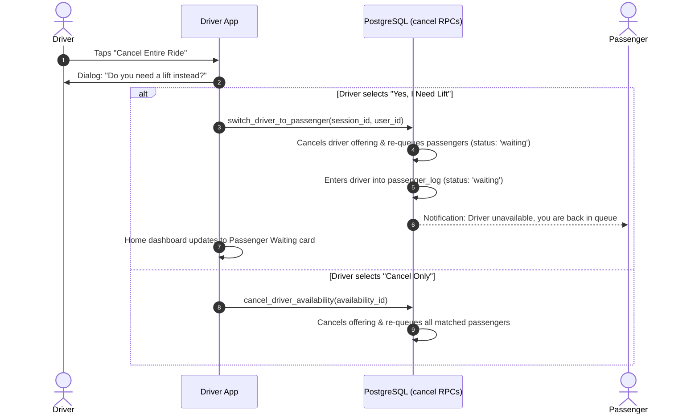
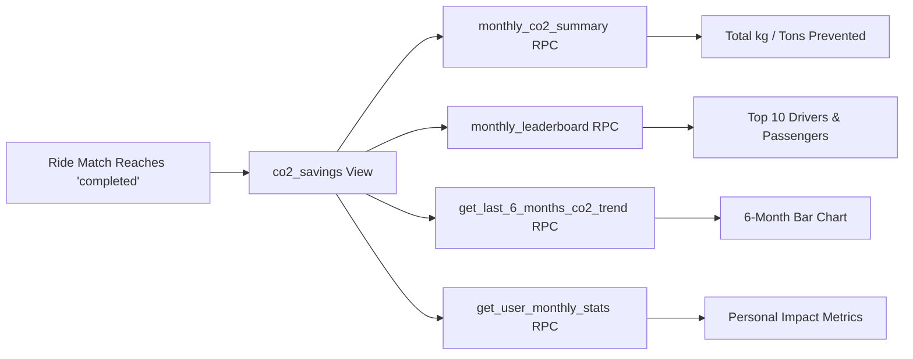

# 🚗 FFL Smart Ride — Comprehensive Backend Architecture & Application Flow

This document provides a complete technical explanation of the **FFL Smart Ride** employee carpooling system built with **Flutter (Dart)** and **Supabase (PostgreSQL, Auth, Realtime, Edge Functions)** for the Township-to-Factory commute route.

---

## 📑 Table of Contents
1. [System Architecture Overview](#1-system-architecture-overview)
2. [Database Schema & Data Model](#2-database-schema--data-model)
3. [Row Level Security (RLS) & Protection Model](#3-row-level-security-rls--protection-model)
4. [Backend Logic & PostgreSQL RPC Functions](#4-backend-logic--postgresql-rpc-functions)
5. [End-to-End Application Lifecycle Flows](#5-end-to-end-application-lifecycle-flows)
   - [5.1 User Authentication & Registration](#51-user-authentication--registration)
   - [5.2 Shift Session Lifecycle & Automation](#52-shift-session-lifecycle--automation)
   - [5.3 Nearest-Passenger Priority Queue & Matching](#53-nearest-passenger-priority-queue--matching)
   - [5.4 Cancellation, Re-Queuing & Driver Switch](#54-cancellation-re-queuing--driver-switch)
   - [5.5 Environmental Impact & Reporting](#55-environmental-impact--reporting)
6. [Realtime Synchronization Architecture](#6-realtime-synchronization-architecture)

---

## 1. System Architecture Overview

```mermaid
graph TD
    subgraph Flutter App [Flutter Mobile Client]
        UI[UI Screens & Widgets]
        Repo[Repositories: Auth, Ride, Reports]
        Client[Supabase Flutter Client]
        UI --> Repo
        Repo --> Client
    end

    subgraph Supabase [Supabase Cloud Infrastructure]
        Auth[Supabase Auth Engine]
        DB[(PostgreSQL Database)]
        Realtime[Realtime Replication Server]
        Edge[Edge Functions / pg_cron]
        FCM[Firebase Cloud Messaging]
    end

    Client -->|HTTPS / WSS| Auth
    Client -->|PostgREST & RPC| DB
    Client -->|WebSocket| Realtime
    DB -->|WAL Stream| Realtime
    Edge -->|Cron Shift Automation| DB
    Edge -->|Push Notifications| FCM
    FCM -->|Push Notification| Flutter App
```

---

## 2. Database Schema & Data Model

The database is designed around a fixed **Township-to-Factory** commute route with predefined pickup stops, shift sessions, and atomic matching states.



### Route Pickup Stops (Fixed Township-to-Factory Layout)
| Stop ID | Stop Name | Order | Description |
|---|---|:---:|---|
| `stop_gate_1` | Gate 1 (Township Main Entrance) | 1 | Main residential entry gate, Security Post 1 |
| `stop_sector_a` | Sector A (Central Park / Mosque) | 2 | Sector A roundabout, near Central Park |
| `stop_comm_center` | Commercial Center (Township Market) | 3 | Main marketplace parking area |
| `stop_sector_b` | Sector B (Staff Quarters / Club) | 4 | Executive club bus bay & Sector B junction |
| `stop_gate_2` | Gate 2 (Township North Exit) | 5 | Township exit towards Factory expressway |
| `stop_factory_main`| Factory Main Plant Gate | 6 | FFL Manufacturing Plant Employee Reception |

---

## 3. Row Level Security (RLS) & Protection Model

All tables enforce strict Row Level Security policies to prevent unauthorized data manipulation and privilege leaks.

| Table | SELECT Policy | INSERT / UPDATE / DELETE Policies | Security Rationale |
|---|---|---|---|
| **`profiles`** | Authenticated users can view all employee profiles. | Users can insert and update **only their own** profile (`auth.uid() = id`). | Colleagues can see each other's names and vehicle numbers, but cannot alter someone else's credentials. |
| **`vehicles`** | Authenticated users can view registered vehicle specs. | Scoped to owner (`auth.uid() = user_id`). | Only the vehicle owner can update make, model, and plate. |
| **`ride_sessions`** | Authenticated users can view active/past sessions. | **Direct client write is disabled.** | Sessions are opened and closed strictly through audited PostgreSQL RPC functions. |
| **`driver_availability`**| Scoped to owner (`auth.uid() = driver_id`). | Scoped to owner (`auth.uid() = driver_id`). | Drivers manage only their own seat quotas. |
| **`passenger_log`** | Scoped to passenger (`auth.uid() = passenger_id`) + Active Drivers in that session. | Scoped to passenger (`auth.uid() = passenger_id`). | Passengers control their own requests; drivers can only view waiting lists while actively offering seats. |
| **`ride_matches`** | Scoped to ride participants (`auth.uid() = driver_id OR auth.uid() = passenger_id`). | **Direct client write is disabled.** | Matches are formed, cancelled, and completed only through transactional `SECURITY DEFINER` RPCs. |

---

## 4. Backend Logic & PostgreSQL RPC Functions

### 4.1 Automatic Profile & Vehicle Creation (`handle_new_user`)
* **Trigger Type**: `AFTER INSERT ON auth.users`
* **Logic**: Intercepts `raw_user_meta_data` provided during signup. In a single atomic database transaction, it populates `public.profiles` and creates the `public.vehicles` record if the user checked "I have a vehicle".

### 4.2 Nearest-Passenger Priority Queue (`get_priority_queue`)
* **Parameters**: `p_session_id UUID, p_driver_id UUID`
* **Sorting Formula**:
  1. Primary: $\text{Proximity} = |\text{passenger\_stop\_order} - \text{driver\_stop\_order}| \text{ ASC}$
  2. Secondary: $\text{requested\_at ASC}$ (First-Come, First-Served tiebreaker)
* **Outcome**: A driver at Stop #4 (Sector B) sees colleagues at Stop #4 first (0 stops away), then Stop #3 & #5 (1 stop away), then Stop #2 & #6 (2+ stops away).

### 4.3 Atomic Multi-Passenger Assignment (`assign_passengers`)
* **Parameters**: `p_session_id UUID, p_driver_id UUID, p_passenger_ids UUID[]`
* **Concurrency & Race-Condition Safety**:
  1. Applies `FOR UPDATE` row lock on `driver_availability`.
  2. Verifies $\text{seats\_remaining} \ge \text{array\_length}(p\_passenger\_ids)$.
  3. Iterates over each passenger ID and acquires a `FOR UPDATE` lock on `passenger_log`.
  4. Verifies `passenger_log.status = 'waiting'`. If another driver already matched this passenger concurrently, the entire transaction **rolls back** with an exception.
  5. Inserts `ride_matches` rows, updates `passenger_log.status = 'matched'`, decrements `seats_remaining`, and writes notifications.

### 4.4 Cancellation Handlers
* **`cancel_match(p_match_id)`**:
  - Marks match as `'cancelled'` with timestamp.
  - Returns passenger to `'waiting'` status while **preserving their original `requested_at` timestamp** so they do not lose priority queue ranking.
  - Recovers +1 seat for the driver.
* **`cancel_driver_availability(p_driver_availability_id)`**:
  - Marks driver availability as `'cancelled'`.
  - Re-queues all active passengers assigned to this driver and dispatches cancellation alerts.
* **`switch_driver_to_passenger(p_session_id, p_user_id)`**:
  - Cancels driver availability and re-queues any previously matched passengers.
  - Automatically registers the user into `passenger_log` with status `'waiting'`.

### 4.5 Environmental Reporting & ESG Analytics
* **`monthly_co2_summary(p_month)`**: Sums completed ride CO₂ reductions and trip counts for the month.
* **`monthly_leaderboard(p_month)`**: Dense ranks top 10 drivers and passengers by completed trips and kilograms of CO₂ saved.
* **`get_last_6_months_co2_trend()`**: Produces a continuous monthly time series for historical trend graphs.
* **`get_user_monthly_stats(p_user_id, p_month)`**: Calculates individual personal statistics (rides given, rides taken, personal kg CO₂ saved).

---

## 5. End-to-End Application Lifecycle Flows

### 5.1 User Authentication & Registration Flow



---

### 5.2 Shift Session Lifecycle & Automation



---

### 5.3 Nearest-Passenger Matching Flow



---

### 5.4 Cancellation, Re-Queuing & Driver Switch Flow



---

### 5.5 Environmental Impact & Reporting Flow

$$\text{kg CO}_2\text{ Saved} = 2.5\text{ km (Route)} \times 0.12\text{ kg/km (Emission Factor)} = 0.30\text{ kg CO}_2\text{ per passenger}$$



---

## 6. Realtime Synchronization Architecture

* **Publication**: PostgreSQL WAL publication `supabase_realtime` replicates changes across:
  * `session_schedule`, `ride_sessions`, `driver_availability`, `passenger_log`, `ride_matches`, `notifications`.
* **Client Subscription**:
  * [DriverPriorityQueueScreen](file:///c:/Users/Zain/Desktop/ffl_smart_ride/ffl_smart_ride/lib/features/rides/screens/driver_priority_queue_screen.dart) listens to `streamPassengerLogChanges(session.id)`. When another driver matches a passenger, the queue silently refreshes to prevent stale selections.
  * [HomeScreen](file:///c:/Users/Zain/Desktop/ffl_smart_ride/ffl_smart_ride/lib/features/home/screens/home_screen.dart) listens to `ride_sessions` to update the active card immediately when shifts open or close.
